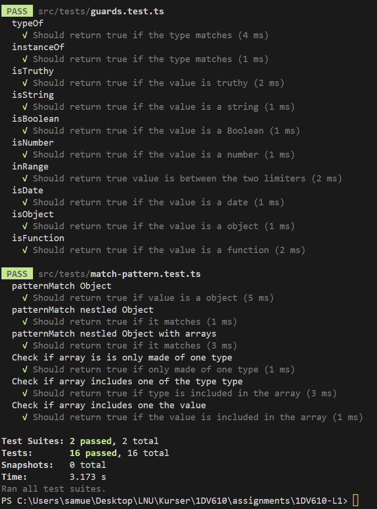

# Mall för inlämning laboration 1, 1dv610
​
## Checklista
  - [x] Jag har skrivit all kod och reflektioner själv. Jag har inte använt mig av andras kod för att lösa uppgiften.
  - [x] Mina testresultat är skrivna utifrån utförd testning ( och inte teoretiskt: "det bör fungera" :) )
  - [ ] Koden är objektorienterad
  - [x] Jag har skrivit en modul som riktar sig till programmerare
​
## Egenskattning och mål
  - [ ] Jag är inte klar eftersom jag vet att jag saknar något. (Då skall du inte lämna in! Lämna då istället in på restlaboration.)
  - [x] Jag eftersträvar med denna inlämning godkänt betyg (E-D)
    - [x] De flesta testfall fungerar
    - [x] Koden är förberedd på Återanvändning
    - [x] All kod samt historik finns i git 
    - [x] Kodkvaliterskraven är ifyllda
    - [x] Reflektion är skriven utifrån bokens kapitel 
  - [ ] Jag eftersträvar med denna inlämning högre betyg (C-B) och anser mig uppfylla alla extra krav för detta. 
    - [ ] Samtliga testfall är skrivna    
    - [x] Testfall är automatiserade
    - [x] Det finns en tydlig beskrivning i hur modulen skall användas (i git)
    - [ ] Kodkvalitetskraven är varierade 
  - [ ] Jag eftersträvar med denna inlämning högsta betyg (A) 
​
Förtydligande: Examinator kommer sätta betyg oberoende på vad ni anser. 
​
## Återanvändning

Alla mina instruktioner för hur man använder min modul återfinns i [README.md](README.md). Där finns även intruktioner om hur man installerar packetet. Detaljerad information om varje funktion finns som kommentarer i projektet.
​
## Beskrivning av min kod

Mitt paket handlar om att kunna kontrollera ett värde mot ett mönster och är menat att vara en mer kraftfull variation av en `switch`. `patternMatch`, `when` och `otherwise` är mina tre viktigaste funktioner. patternMatch tar in en parameter och returnerar en funktion. Funktionen förväntar sig `when` funktioner som parametrar.  
````js
when(isNumber, () => console.log('It is a number'))
// or
when({statusCode : inRange(200, 299)}, () => console.log('status code is inbetween 200 and 299'))
````
En `when` funktion består utav två delar den första delen är antingen en funktion eller ett objekt vars värden också är funktioner. Dessa funktioner ska kunna evalueras till antingen sant eller falskt vid körning. Den andra delen är en funktion och är det som ska ske om det förstnämnda evalueras till sant. 
````js
otherWise(() => console.log('No match'))
````

`otherwise` fungerar exakt likadant som en `when` funktion men saknar den fösta delene eftersom den nu i `otherwise` alltid evalueras till sant. `patternMatch` går sekventiellt igenom alla `when` funktioner vilket betyder att ordning spelar roll. Läs mer i [README.md](README.md).


## Hur jag testat
Jag har testat min kod med automatisk testning. Alla funktioner har tester och enligt de tester jag skrivit bör allt fungera såsom jag vill. Test verktyget är [Jest](https://jestjs.io/) vilket är ett förtjusande simpelt ramverk att använda.
​
### Testfall

​
​
## Kodkvalitetskrav
​

### Namngivning
​
| Namn och förklaring                                                   | Reflektion                                                                                                                                                                                  |
| --------------------------------------------------------------------- | ------------------------------------------------------------------------------------------------------------------------------------------------------------------------------------------- |
| `isNumber` - funktion som kontrollerar om ett värde är en siffra.     | **Pick one word per concept**, Utöver dennna funktion finns det en rad utav funktioner som fungerar på ett liknande sett och som också använder sig av `is` i början, exempelvis `isString` |
| `when` - Beskrivs högre upp.                                          | **Add meaningfull context**, `when` i sig själv säger inte så mycket. Men i rätt kontext dvs i kombination med `patternMatch` är det uppenbart hur och vad som fortgår.                     |
| `otherwise` - Beskrivs högre upp                                      | **Use pronounceable names**                                                                                                                                                                 | Är ett engelskt ord så med andra ord extremt lätt att utala. |
| `patternMatch` - Beskrivs högre upp                                   | **Use solution domain rules**, pattern matching är en term som används inom datavetenskap. Jag lärde mig om det när jag gick en kurs i `Scala`.                                             |
| `isUndefined` - Funktion som kontrollerar om ett värde är `undefined` | **Method names**, använder sig utav "is" vilket är ett verb som uteslutande används för att används för beskriva ett tillstånd. Vilket i det här fallet är väldigt passande.                |
​
### Funktioner
​
| Metodnamn och förklaring                                          | Reflektion |
| ----------------------------------------------------------------- | ---------- |
| `isNumber` - funktion som kontrollerar om ett värde är en siffra. | **Use Descriptive Names**, Enligt clean code ska man ha tydliga funktions namn som beskriver vad funktionen gör.       |
| `when` - Beskrivs högre upp.                                      | **Small**, enligt clean code ska funktioner vara små och den är ett prakt exempel av en liten funktion som omsluter två funktioner i ett objekt literal och returnerar dem.         |
| `otherwise` - Beskrivs högre upp.                                 |  **Do one thing**, enligt clean code ska en funktion bara göra en sak. Denna funktion omsluter två funktioner i ett objekt literal och returnerar dem.      | 
| `isTruthy` - returnerar om det värdet kan evalueras till sant                              | **Have no side effects**, funktionen har inga sido effekter och därmed ändrar inte på något i det som skickas in.             |
|       `isObject` - Funktion som kontrollerar om ett värde är ett objekt                                                           |   **Function Arguments**, enligt clean code ska funktioner ta så få argument som möjligt. `isObject` tar endast ett vilket är exakt vad clean code föredrar.         |

​
## Laborationsreflektion
Reflektera över uppgiften utifrån ett kodkvalitetsperspektiv. Använd begrepp ifrån boken.

Det har varit kul och intressant att jobba med den här uppgiften. När jag började ge mig in i kapitel två så ställde jag mig frågan: "Hur svårt kan det vara att skriva bra variabel/funktions namn?". Jag inser att det var naivt att tro att det inte skulle vara en vetenskap i sig. 

Jag tycker Clean code har gett mig kunskapen att skriva bättre och tydligare kod. Den viktigaste biten är att den har gett mig insikten att kunna se mina brister ur en annans kodares perspektiv och att det är väldigt lätt att vara hemmablind. 

Den koden jag skrivit är dock inte perfekt och även jag tycker att vissa saker är otydliga. Speciellt funktionen `checkCondition` är svårt förståelig. Jag kunde dock inte komma på ett bättre namn för den.

Ett annant problem jag stötte på var att det paketet jag ville skapa passar bättre för `funktionell programmering`. Paketet är därmed implementerat funktionellt (Vi har pratat igenom detta och kom fram till att nästa projekt ska vara `objekt orienterat`).

Om jag hade valt att skriva koden `objekt orienterat` hade den istället kanske sett ut något såhär:
````js
const example = 'A string' 
(new Pattern(example, [
  new When(isString, () => console.log('It is a string!')),
  new When(isNumber, () => console.log('It is a number!')),
  new OtherWise(() => console.log('There was no match!'))
])).match()
````

Jag är delvis nöjd med min insatts. Jag tycker komplexiteten, även om det är lite kod, är hög. 